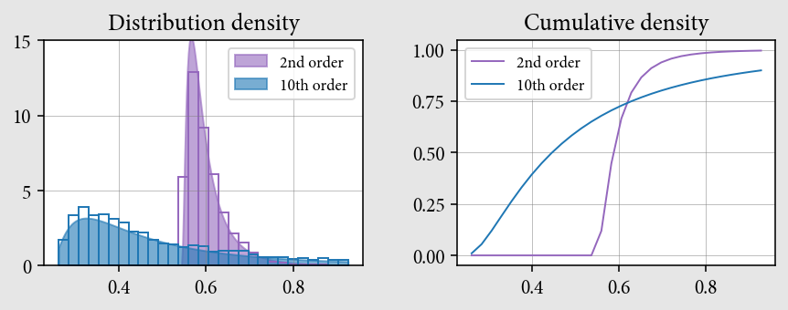

# Effects of Degrees of Freedom in Predictive Models

This repository introduces a project which aims to study and show the benefits or compromises related to the choose of the number of degrees of freedon (complexity) of a predictive model with respect to its use in data science and/or data mining.

## *Table of Contents*

1. [Repository Contents](#contents)
2. [Motivation](#motivation)
3. [Introduction](#introduction)
4. [Summary](#summary)

    4.1. [Simulation Setup](#setup)    
    4.2. [Post Processing](#post-processing)    
    4.3. [Error Distribution Analysis](#error-analysis)    
    4.4. [Final Thoughts](#final-thoughts)

---

## 1. Repository Contents

* Notebooks:
    - `01_simulation_setup.ipynb` - *The main guidelines for this project are presented. The simulations which are providing the data for the later analsis are set up and ran on this notebook.*
    - `02_visualization.ipynb` - *This notebook focus on post processing simulations' outputs and visualizing the drawn results.*
    - `03_distribution_analysis.ipynb` - *More in-depth and detaild anayliss following the results previously obtained.*

* Directories:
    - `resources` - *A folder holding custom python scripts and modules developed for this project.*
    - `outputs` - *Stores the files from each run of the simulation ran in `01_simulation_setup.ipynb`.*
    - `imgs` - *Graphs and visualizations computed throughtout the project and which are object of anlysis.*

* Others:
    - `data.npy.npy` - *array used as target variable in regressoin task.*
    - `n_sizes.npy` - *array from the numpy `mgrid` object.*
    - `noise_std.npy` - *array from the numpy `mgrid` object.*
    - `results.npy` - *2D ndarray object with the post processed simulation outcome.*

## 2. Motivation

The motivation for this project relies on the practical use of predictive models in data science. Since data-driven decision making processes are becoming widely accepted in many fields, the outcomes of such models become also more impactful on businesses, and potentially on people's lives. Therefore it's worth studying and enhancing the use and knowledge on how these models performn.

This project undertakes on a high level the task of demonstrating how model's complexity can affect performance, and by doing so, to produce relevant support knowledge for designing data driven decision making systems.

## 3. Introduction

This project has as objective to explore how model complexity influences predictive tasks in *machine learning* and *data mining*.

With this in mind, it was designed an experiment with two main varying parameters. The experiment consists on a basic *supervised task* of fitting two models, a low complexity model and another of higher complexity, into given data (target). The varying parameters of the experiment are *sample size* – the size of the sample on which the models will be trained – and *noise level* – the variance of a zero-centered gaussian random variable which provides increments to be added to the sample in order to simulate real noisy data.

The supervised task consists in a *regression (no regularization)* task, upon which the models will be tested and the metric used to measure their perfomance is the *mean squared error*.

In order for this experimeent to produce representative data and results suitable for further analysis the models will be compared with respect to their *generalization error*. On this regard, the experimennt is shaped as a simulation on the space generated by the combination of the parameters *sample size* and *noise level*. The results are properly post processed, and a preliminar analysis of the results is presented followed by a detailed analysis where the effects of the complexity chosen for a model are more transparent.

The computations were designed to take benefit of the optimizations provided by `ndarrays` belonging to the **numpy** library, whether when dealing with algebraic calculations or by the use of functions/classes within **scipy** pertaining to statistical distributions. **Matplotlib** was used to design plots and graphs for results' presentation.

## 4. Summary

As disucussed in the prior setion, *Introduction*, the project execution is guided by distinct stages. For each one of those, there is a particular noteobok where the actions are explained in more details. Nonetheless, each one will be described below alongside the presentation of the main results and the main insights drawn from their analysis.

### 4.1. Simulation Setup 

The simulation consists in fitting a low complexity model and a high complexity model on samples from the target for every possible combination of the parameters (sample size and noise level).

*Complexity*, the main goal to be examined in this project, has a specific meaning which relates to the *degrees of freedom* a model holds. The more complex a model is, more degrees of freedom it has.

On this project, a degree of freedom is represented by a polynomial in such way that for example, in a model with 10 degrees of freedom, they are represented by polynomials of ascending order from 0 to 9. The target is designed as a polynomial model ([Legendre polynomials](link here)) with 20 degrees of freedom. The models of **higher complexity** and **lower complexity** have respectively 2 and 10 degrees of freedom.

For the pairs – sample size, noise level – the quantity to be computed is the differene between the generalization error from the models such that it's positive when the less complex model gives the minor expected error, and negative otherwise.

The range of values for the paraemeters are as follow:

| Parameter | Min. Value | Max. Value | Resolution (points) | 
| --------- | ---------- | ---------- | ------------------- |
| Sample size | 10 | 150 | 140 |
| Noise level | 0.1 | 2.0 | 120 |

The generalization error associated with each degree of complexity was computed by estimating both the *variance* and the *bias* of the model. These estimatives were taken by fitting many models into random samples from the target for a given specific pair of values for the parameters *(sample size, noise level)*. This procedure is adopted for each of the two levels of complexity. Thus at each specific pair of values for the parameters there are 2 batches of models, one with models with 2 degrees of freedom and another batch for models of 10 degrees of freedom.

Ther results are presented with the values of *sample size* in the horizontal axis and the values of *noise level* in the vertical axis. On this framework, in a cartesian plane, the result associated with each value *(sample size, noise level)* has its magnitude mapped into a color map ranging from *blue* (lower values) to *red* (higher values).

Examples of the results of such simulations are as follows

Due to the limited computational power the size of the batches was limited to only a few hundreds, thus these first results being regarded only as intermediate results which requires further processing.

### 4.2. Post Processing

Since the results are directly related to measure of *error*, the lower the value the better. The simulations points out initially to a region where the lower complexity model (red region) has the lowest error magnitude and another dominated by the high complexity model (blue region), but the images aren't seemingly converged results as they are cleary noisy which undermines its use for futher analysis.

To overcome this issue, many of these simulated results are combined with its extreme values extracted in order to compose a final graph representative of the true *expected* performance of the models considered.

The experiment's results after post processing are shown below:

The graph shows that 
* As te `sample size` increases the **high complexity** model becomes more precise (negative value in the difference between the generalization errors), which is in accordance with the *bias-variance trade-off*.

* The **high coplexity** model presented itself more sensible to noise introduced to the samples. The higher the `noise level` more slowly the **high complexity** model overcomes the **low complexity** one. Thus, the noise implies that bigger samples are required to actually take benefit of using more deegres of freedom in a model.

* There is a clear region (the green stripe) where both models presents apparently the same expected generalization error, what can be regarded as inconclusive for the moment with regards to which one perfoms better, only the measure of generalization error isn't enough to differentiate them.

### 4.3. Error Distribution Analysis

As the *expected generalizaion error* alone can't approach all aspects on which the *complexity* can impact in the model's performance, it was run more simulations in two specfic points along the stripe where both models have similar expected generalization error, in other words, points in the green range on the previous graph. The points were selected in order to reflect the states of low and high intensity noise.

For each case – regarding the noise intensity level – it was generated a significantly greater batch for each model, and the *mean squared error* of each individual fitted polynomial was computed from where a distribution could be drawn. The errors' distribution of each model were then fitted into a *lognormal probability density function*. They are shown below

* Low Noise Case (Noise level 0.5 / Sample size 75)

* High Noise Case (Noie level 1.8 / Sample size 105)

Observarions:

* The distributions show a very distinct panorama from what could be inferred from the first experiment alone. This in-depth analysis indicates that the **high complexity** model has a very wide right tail whereas the **low complexity** model is much less skewd and its density function is more concentrated around its *expected* error.

* For that reason, although both models have virtually the same *expected* error, it's mostly due to the long right tail in the **high complexity** model while other measures of center as the *median* or *mode* would indicate a much more favorable scenario for the **high complexity** model.

* As such, in both cases, low and high intensity of noise, there is a high probability (at least .5 for the high intensity noise and at least .6 for the low intensity noise) of the **high complexity** model providing better performance regardless of how the **low intensity** model performs.

* The **low complexity** model has as advantage its more predictable behavior as the errors fall within a relatively short range of values.

* The noise tends to flatten both density functions, but the **high complexity** model, qualitatively, is the more impacted as the probablity of extreme events on its long tail rises.

### 4.4. Final Thoughts

In general sense a model with more degrees of freedom is preferable against simpler models due to the latter having higher *bias*. To deal with overfitting, the most basic approach is to use retention set for validation or techniques as cross-validation.

Yet, it is also useful to understand the basic characteristics which models of different number of degrees of freedom can have. As these models are applied into real world situations, the choice made by the analyst or the data scientist regarding which model is suitable for the situation at question may take into account other considerations then quantitative methods alone as those used to prevent overfitting.

It was shown that models with higher degrees of freedom are more inclined to not align with the desired target, instead they will capture a higher portion of the noise in comparison to simpler models. In case where noise in data is a variable of relevance, whether because it's too high or there isn't a posibility of qualifying it, a more conservative choice for predictive models could be preferable dependening on the specific case.

Moreover, in the short term, although being more inclined to overfitting, more degrees of freedom could provide more accurate predictions in the majority of situations as the bulk of the density function tends to have its "mass concentration" in zones where the magnitude of the error is small, although in the long run, due to its long-tail aspect, it might not be so reliable.
